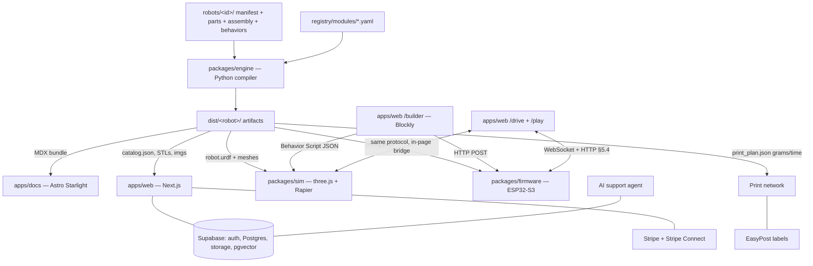

# BOTFORGE — Master Build Plan v1.0

**Codename:** `botforge` (placeholder — rename with one global find/replace when the brand is chosen)
**Owner / only human operator:** Lewis Weldon — H4Z Development Services Ltd, Gibraltar
**Prepared:** July 2026
**Audience:** An AI coding agent (Claude Code) executing this plan end-to-end, with Lewis as reviewer.

**Quickstart for the agent:** Read this entire document once. Then execute Phase 0 (§6). Do not skip ahead. Do not start Phase N+1 until Phase N's acceptance checklist is fully green.

---

## 0. HOW TO EXECUTE THIS PLAN (rules for the agent — read first)

1. **Phases run strictly in order** (0 → 7; Phase 8 is human-led). Within a phase, tasks run in order unless marked parallel-safe.
2. **This document is the source of truth.** If something is ambiguous, choose the *simplest* option consistent with the Design Principles (§2.3) and log it in `docs/DECISIONS.md` (date, decision, reason). Do not silently invent scope.
3. **The contracts in §5 are frozen.** Changing a schema, protocol message, or file layout requires a `DECISIONS.md` entry plus a migration note. Everything else in the codebase depends on §5 being stable.
4. **🧍 HUMAN stop points.** Wherever you see 🧍, stop and ask Lewis. These are: creating third-party accounts, entering live API keys, anything involving payments going live, legal text approval, ordering physical goods, and physically testing hardware.
5. **The cardinal rule: robot-specific logic lives ONLY in `robots/<id>/` data files.** If implementing a new robot requires editing engine, firmware, sim, or app *code*, the design is wrong — generalise the system instead. This rule is what makes the whole business work.
6. **Every phase ends with:** all tests green in CI, the acceptance checklist ticked, and a short `docs/reports/PHASE-N.md` (what was built, deviations + DECISIONS refs, how Lewis can verify locally in <10 minutes).
7. **Testing is not optional.** Golden-file tests for every generator, unit tests for every interpreter/driver, Playwright for critical web flows. A weaker model executing this plan should lean on tests to know it hasn't broken anything.
8. **Boring tech only.** The stack in §4.2 is fixed. Do not swap libraries without a DECISIONS entry — familiarity and training-data coverage are features here.
9. **Secrets** only via `.env` / GitHub Actions secrets / Vercel env vars. Never committed, never hardcoded, never echoed into logs.
10. **Code output style:** complete files, never fragments or `...` elisions (owner preference; also keeps the repo copy-paste reproducible).
11. Keep a running `docs/BACKLOG.md` for good ideas that are out of scope for the current phase. Do not implement them.

---

## 1. WHAT WE ARE BUILDING

An open, modular robotics platform — "LEGO for real robots." People learn robotics by assembling palm-sized robots from standard electronic modules and 3D-printed bodies. They can buy parts, self-source them from a generated shopping list, or print bodies themselves; people without printers get parts made and shipped by a certified community printer near them (we take a commission). A no-code block builder programs the robot, a browser simulator runs the exact same program virtually, and one universal firmware runs every robot. **Every artifact — CAD files, wiring diagrams, LEGO-style assembly instructions, BOM, docs, firmware config, simulator model, store page — is compiled automatically from a single manifest file per robot.** That compiler is the product and the moat.

### 1.1 Users

| Persona | Role | Notes |
|---|---|---|
| Builder | Buys/sources parts, prints or orders parts, assembles, plays | Maker adults + teens 14+. NOT marketed to under-14s (§H) |
| Printer operator | Supply side of print network, earns money per job | Hobbyists with idle printers |
| Educator | Classroom kits + curriculum | Phase 9+, not launch |
| Designer | Publishes mods/robots on marketplace | Phase 9+, not launch |

### 1.2 Revenue streams

| # | Stream | Mechanism | Phase live |
|---|---|---|---|
| 1 | Print network commission | 18% platform fee on fulfilled print jobs | 5 |
| 2 | Pro subscription | $4.99/mo or $39/yr — cloud saves, advanced sim arenas, AI robot personality, OTA push, priority support | 4 |
| 3 | Affiliate revenue | Every BOM line links out via tracked affiliate redirects (AliExpress/Amazon/Pimoroni/etc.) | 4 |
| 4 | Curated electronics kits | Batch-manufactured, held at a 3PL, no battery included | 8+ (needs capital) |
| 5 | Core PCB | Custom board replacing devkit + modules, made-to-order via JLCPCB | 8+ |
| 6 | Designer marketplace | Rev-share on community robots/mods | 9+ |
| 7 | Education licenses | Curriculum + classroom management | 9+ |
| 8 | Engine licensing (B2B) | License the manifest→everything compiler to other kit makers | 10+ |

### 1.3 Explicit non-goals at launch

- **We never hold or ship inventory ourselves.** Physical goods flow vendor→customer, printer→customer, factory→customer.
- **We never ship lithium batteries.** Users source cells locally; the BOM links to them. Kits (later) exclude the battery.
- **No under-14 toy marketing** — keeps us out of EN 71 / toy-directive scope (§H).
- **No custom PCB before Phase 8.** Launch robots use an off-the-shelf ESP32-S3 devkit + breakout modules. De-risks everything.
- **No native mobile apps.** The web app is a PWA; it works on phones.
- **International print matching is same-country only at launch** (no customs headaches).

---

## 2. CONSTRAINTS & DESIGN PRINCIPLES

### 2.1 Operating constraints
- One human operator. The business must run unattended overnight ("sleep-safe": nothing requires same-hour human action).
- Worldwide from day one.
- ~£0 capital for stock, warehousing, or fulfilment.

### 2.2 The automation consequence
Nothing may be authored twice. A robot is *data*; the system compiles data into every downstream artifact. Adding robot #10 must cost days of design work, not weeks of documentation work.

### 2.3 Design principles (referenced as P1–P8 throughout)

- **P1 — The manifest is the truth.** One `robot.yaml` (+ `assembly.yaml`, parametric part scripts, behaviors) fully defines a robot.
- **P2 — One universal firmware.** A single binary for all robots; a generated `config.json` tells it which modules exist on which pins. New robot = new config, not new firmware.
- **P3 — One behavior format.** The Behavior Script JSON (§5.3) produced by the block builder runs *identically* in the browser simulator (TypeScript interpreter) and on the robot (C++ interpreter).
- **P4 — Generate, don't author.** CAD, wiring, instructions, BOM, docs, URDF, store pages: all generator outputs.
- **P5 — Boring tech.** Maximise ecosystem maturity and AI-agent familiarity.
- **P6 — No atoms.** See §1.3.
- **P7 — Support is a product.** Docs are generated per robot; an AI support agent is grounded in them (Phase 7).
- **P8 — Robots work offline.** No cloud dependency to drive or run a robot. Cloud adds convenience, never gates core function.

---

## 3. SYSTEM ARCHITECTURE



### 3.2 Component inventory

| Component | Path | Language | Purpose |
|---|---|---|---|
| Engine | `packages/engine` | Python 3.12 | Compiles manifests → all artifacts. CLI `botforge` |
| Module registry | `registry/modules/*.yaml` | YAML | Catalog of electronic modules (§5.1) |
| Robot definitions | `robots/<id>/` | YAML + Python part scripts + JSON | Per-robot data (§5.2) |
| Firmware | `packages/firmware` | C++ (Arduino core / PlatformIO) | Universal ESP32-S3 firmware + Behavior VM |
| Behavior lib | `packages/behavior-ts` | TypeScript | BSJ types, zod schema, reference interpreter |
| Simulator | `packages/sim` | TypeScript | three.js + Rapier physics, loads generated URDF |
| Shared types | `packages/shared` | TypeScript | Types generated from JSON Schemas |
| Web app | `apps/web` | Next.js 14 (App Router) | Site, catalog, builder, sim, drive, flasher, store, print network, admin |
| Docs site | `apps/docs` | Astro Starlight | Per-robot build guides (content generated by engine) |
| Infra | `infra/`, `.github/workflows/` | YAML/Docker | CI, engine container (includes PrusaSlicer CLI) |

### 3.3 Data flow (canonical build)

1. Author `robots/rover-v1/` data (once, by a human/agent designer).
2. `botforge build robots/rover-v1` → validates against registry, then runs generators: CAD → wiring → BOM → print plan → assembly renders → URDF → firmware config → docs MDX → catalog.json.
3. CI uploads `dist/rover-v1/` to Supabase Storage + attaches firmware binaries to a GitHub Release.
4. Web + docs consume artifacts. Sim loads the URDF. Flasher page serves the release binaries via ESP Web Tools.
5. Builder produces BSJ → runs in sim → same file POSTed to the physical robot.

---

## 4. MONOREPO & TOOLING

### 4.1 Repository layout

```
botforge/
├── apps/
│   ├── web/                  # Next.js 14, TS, Tailwind
│   └── docs/                 # Astro Starlight
├── packages/
│   ├── engine/               # Python (uv). Package botforge_engine, CLI `botforge`
│   ├── firmware/             # PlatformIO project
│   ├── behavior-ts/          # BSJ types + interpreter
│   ├── sim/                  # three.js + rapier world
│   └── shared/               # TS types generated from schemas
├── registry/
│   ├── modules/*.yaml        # §5.1
│   └── fasteners.yaml
├── robots/
│   ├── _test-min/            # tiny fixture robot for golden tests
│   └── rover-v1/             # first product robot
├── dist/                     # build output, gitignored (CI artifact)
├── infra/
│   ├── engine.Dockerfile     # python + cadquery + prusaslicer CLI + EGL
│   └── profiles/pla-0.20.ini # slicer profile
├── docs/                     # internal: DECISIONS.md, BACKLOG.md, reports/
├── .github/workflows/ci.yml
├── turbo.json  package.json  pnpm-workspace.yaml
└── PLAN.md                   # this file
```

### 4.2 Fixed stack (do not substitute — see rule 8)

| Area | Choice | Why |
|---|---|---|
| JS workspace | pnpm 9 + Turborepo, TypeScript 5, Node 20 | Standard, fast, well-known |
| Web | Next.js 14 App Router + Tailwind, deployed on Vercel | Solo-founder default, huge training coverage |
| Backend | Supabase (Auth, Postgres + RLS, Storage, pgvector, Edge Functions) | One vendor for auth/db/files/vectors |
| Payments | Stripe (Checkout, Billing, Tax) + Stripe Connect Express (printer payouts) | Handles global tax + marketplace payouts |
| Shipping labels | EasyPost | One API, many carriers |
| Email | Resend | Simple transactional email |
| Analytics | Plausible | Privacy-friendly, zero-config |
| Python | 3.12 + uv + pydantic v2 + typer + Jinja2 | Engine stack |
| CAD | CadQuery 2.4 (code-driven parametric CAD) | Scriptable, exports STL/STEP/3MF |
| Mesh QC / render | trimesh + pyrender (offscreen EGL) | Headless assembly renders |
| Wiring diagrams | WireViz | YAML → SVG harness diagrams + wire BOM |
| Slicing estimates | PrusaSlicer CLI (in engine Docker image) | Grams + minutes per part → auto print pricing |
| Blocks | Blockly 11 | The standard for block programming |
| Sim | three.js + @dimforge/rapier3d-compat + urdf-loader | Browser physics, WASM, deterministic stepping |
| Firmware | PlatformIO, arduino-esp32 core 3.x, ESP32-S3 (devkit: ESP32-S3-DevKitC-1 N8R2), ArduinoJson 7, LittleFS | Easiest robust path; native USB |
| Browser flashing | ESP Web Tools (esptool-js) | Flash from Chrome, zero installs for users |
| Tests | vitest, pytest, `pio test` (native env), Playwright | Per-layer testing |
| Errors/monitoring | Sentry + UptimeRobot | Sleep-safe ops |

### 4.3 Root commands (wire these up in Phase 0)

| Command | Does |
|---|---|
| `pnpm dev` | Runs web + docs dev servers (turbo) |
| `pnpm test` | All JS tests |
| `pnpm build` | Builds all JS apps/packages |
| `uv run botforge validate robots/rover-v1` | Schema + registry validation |
| `uv run botforge build robots/rover-v1 [--only cad,wiring,...]` | Full artifact build → `dist/` |
| `pnpm fw:build` | PlatformIO build (wraps `pio run` in packages/firmware) |
| `pnpm fw:test` | Behavior VM native tests (`pio test -e native`) |
| `pnpm e2e` | Playwright suite |

### 4.4 CI (GitHub Actions, single `ci.yml`)

Jobs: `lint` (eslint/prettier/ruff) → `test-js` → `test-py` → `engine-build` (runs `botforge build` for `_test-min` + `rover-v1` inside `infra/engine.Dockerfile`, asserts goldens, uploads `dist/` artifact) → `firmware-build` (pio, uploads merged `firmware-merged.bin` + `esp-web-tools-manifest.json`) → `web-build`. On tags `v*`: attach firmware binaries to a GitHub Release; sync `dist/` to Supabase Storage; Vercel deploys web+docs from main.

---

## 5. CORE CONTRACTS (frozen — see rule 3)

These five specifications are the interfaces between every part of the system. Implement them exactly.

### 5.1 Module Registry — `registry/modules/<id>.yaml`

One YAML file per electronic module. Fields:

| Field | Type | Notes |
|---|---|---|
| `id` | str | kebab-case, unique |
| `name` | str | Human name |
| `category` | enum | `core` \| `power` \| `actuator` \| `sensor` \| `output` \| `input` \| `passive` |
| `electrical.vcc` | str | e.g. `"3.0-10.8V"` |
| `electrical.logic_v` | num | 3.3 |
| `electrical.current_ma` | {typ, max} | For power budget check |
| `electrical.pins[]` | list | `{name, type, required}` — type ∈ `gpio, pwm, adc, i2c_sda, i2c_scl, 5v, 3v3, gnd, vbat` |
| `firmware.driver` | str | C++ class name the universal firmware instantiates |
| `firmware.params` | dict | Default driver params (JSON-schema-lite; engine copies into config.json) |
| `mech` | dict | `{dims_mm:[x,y,z], mass_g, mount:{pattern, screws}}` — pattern is a named cadlib helper, e.g. `sg90_pocket` |
| `wiring` | dict | `{connector, pinout:[...], wire_colors:{...}}` — feeds WireViz |
| `sourcing[]` | list | `{vendor, label, url, price_usd, affiliate_key}` — multiple vendors per module |
| `docs` | dict | `{blurb, datasheet_url, troubleshooting:[{symptom, fix}]}` — troubleshooting snippets are compiled into robot docs |
| `sim` | dict | Hints: `{kind: tof_raycast|line_ir|motor_dc|servo|led|buzzer|imu, ...}` |

**Launch module set (author all 12 in Phase 1):**

| id | driver | Notes | ~USD |
|---|---|---|---|
| `core-esp32s3-devkit` | `CoreS3Devkit` | ESP32-S3-DevKitC-1 N8R2; exposes gpio map | 8.00 |
| `pwr-1s-boost` | `PowerMon` | 18650/1S Li-ion charger+5V boost shield (USB-C). Battery NOT included/shipped | 2.50 |
| `motor-n20` | — (driven via drv-8833) | N20 metal-gear 6V 150RPM | 3.00 |
| `drv-8833` | `Motor_DRV8833` | Dual H-bridge breakout | 1.50 |
| `servo-sg90` | `Servo_Std` | 9g 180° | 2.00 |
| `servo-mg90s` | `Servo_Std` | Metal-gear 9g | 3.50 |
| `sens-vl53l0x` | `Range_VL53L0X` | I2C time-of-flight, 2m | 2.50 |
| `sens-line-2ch` | `Line_TCRT` | 2× TCRT5000 analog line sensors | 1.50 |
| `led-ws2812-2` | `Pixel_WS2812` | 2-pixel "eyes" stick | 0.50 |
| `buzzer-passive` | `Buzzer_PWM` | Passive piezo | 0.30 |
| `sw-slide` | — (passive) | Power switch | 0.20 |
| `imu-mpu6050` | `IMU_6050` | Deferred to Phase 6 robots | 2.00 |

**Full example — `registry/modules/drv-8833.yaml`:**

```yaml
id: drv-8833
name: DRV8833 dual motor driver
category: actuator
electrical:
  vcc: "2.7-10.8V"
  logic_v: 3.3
  current_ma: { typ: 400, max: 1500 }
  pins:
    - { name: vcc,  type: 5v,   required: true }
    - { name: gnd,  type: gnd,  required: true }
    - { name: ain1, type: pwm,  required: true }
    - { name: ain2, type: pwm,  required: true }
    - { name: bin1, type: pwm,  required: true }
    - { name: bin2, type: pwm,  required: true }
    - { name: slp,  type: gpio, required: false }
firmware:
  driver: Motor_DRV8833
  params: { pwm_hz: 20000, slew_per_s: 400 }
mech:
  dims_mm: [20, 15, 3]
  mass_g: 2
  mount: { pattern: pcb_m2_2hole_15mm, screws: m2x6_selftap }
wiring:
  connector: dupont_2_54
  wire_colors: { vcc: red, gnd: black, ain1: yellow, ain2: orange, bin1: green, bin2: blue, slp: white }
sourcing:
  - { vendor: aliexpress, label: "DRV8833 module", url: "https://www.aliexpress.com/w/wholesale-drv8833.html", price_usd: 1.50, affiliate_key: ali }
  - { vendor: amazon, label: "DRV8833 (3-pack)", url: "https://www.amazon.com/s?k=drv8833", price_usd: 7.99, affiliate_key: amz }
docs:
  blurb: Drives both wheel motors. Tiny H-bridge chip on a breakout board.
  datasheet_url: https://www.ti.com/lit/ds/symlink/drv8833.pdf
  troubleshooting:
    - { symptom: "One wheel spins the wrong way", fix: "Swap that motor's two wires at the driver, or flip its +/- in the builder's motor settings." }
    - { symptom: "Motors twitch or robot reboots when driving", fix: "Battery is low or wires too thin — charge the cell and check the 5V/GND wires are seated." }
sim:
  kind: motor_dc
```

**Second example — `registry/modules/servo-sg90.yaml`:**

```yaml
id: servo-sg90
name: SG90 micro servo
category: actuator
electrical:
  vcc: "4.0-6.0V"
  logic_v: 3.3
  current_ma: { typ: 150, max: 700 }
  pins:
    - { name: vcc, type: 5v,  required: true }
    - { name: gnd, type: gnd, required: true }
    - { name: sig, type: pwm, required: true }
firmware:
  driver: Servo_Std
  params: { min_us: 500, max_us: 2400, deg_min: 0, deg_max: 180, attach_stagger_ms: 60 }
mech:
  dims_mm: [23, 12.2, 29]
  mass_g: 9
  mount: { pattern: sg90_pocket, screws: m2x8_selftap }
wiring:
  connector: servo_3pin
  wire_colors: { vcc: red, gnd: brown, sig: orange }
sourcing:
  - { vendor: aliexpress, label: "SG90 servo", url: "https://www.aliexpress.com/w/wholesale-sg90.html", price_usd: 2.00, affiliate_key: ali }
docs:
  blurb: Small hobby servo, rotates 0–180°.
  datasheet_url: ""
  troubleshooting:
    - { symptom: "Servo buzzes at rest", fix: "Normal under light load; if hot, check nothing is jamming the horn." }
sim:
  kind: servo
```

Also create `registry/fasteners.yaml`: entries `{id, name, spec, sourcing[]}` for `m2x6_selftap`, `m2x8_selftap`, `m2_heatinsert_optional`, `m3_ball_6mm` (caster ball).

### 5.2 Robot Manifest — `robots/<id>/robot.yaml` (+ `assembly.yaml`, `parts/*.py`, `behaviors/*.json`)

| Field | Notes |
|---|---|
| `schema_version` | `1` |
| `robot: {id, name, tagline, version, size_class, difficulty, est_build_minutes, hero_color}` | `size_class: palm`, `difficulty: beginner` for rover |
| `modules[]` | Instances: `{id, ref, label}` — `ref` points at registry id; `id` is instance id (e.g. `motor_left`) |
| `connections[]` | Electrical edges: `{from: <inst>.<pin>, to: <inst>.<pin>, len_mm, note?}`. **This is the single source for the wiring diagram AND the firmware pin config** (P1). Core pins are `core.gpioN`, power pins `pwr.5v`/`pwr.gnd` |
| `printed_parts[]` | `{id, script, params{}, qty, material, color_role}` — `script` is a file in `parts/` exposing `build(params) -> cq.Workplane` |
| `fasteners[]` | `{ref, qty}` from `registry/fasteners.yaml` |
| `assembly` | `"assembly.yaml"` |
| `behaviors[]` | `{id, file, default?}` |
| `firmware: {autostart_behavior}` | |
| `sim: {drive: diff, wheel_radius_mm, track_mm, arena_default}` | Kinematics hints for the sim |
| `options[]` | Phase 6 configurator: optional module slots `{slot, ref, adds_connections[], adds_parts[]}` |

**Complete first robot — `robots/rover-v1/robot.yaml`:**

```yaml
schema_version: 1
robot:
  id: rover-v1
  name: Rover
  tagline: A palm-sized explorer that dodges obstacles and follows lines.
  version: 1.0.0
  size_class: palm
  difficulty: beginner
  est_build_minutes: 90
  hero_color: "#ff6b35"

modules:
  - { id: core,        ref: core-esp32s3-devkit, label: Brain }
  - { id: pwr,         ref: pwr-1s-boost,        label: Power }
  - { id: mdrv,        ref: drv-8833,            label: Motor driver }
  - { id: motor_left,  ref: motor-n20,           label: Left motor }
  - { id: motor_right, ref: motor-n20,           label: Right motor }
  - { id: range,       ref: sens-vl53l0x,        label: Distance eye }
  - { id: line,        ref: sens-line-2ch,       label: Line sensors }
  - { id: eyes,        ref: led-ws2812-2,        label: LED eyes }
  - { id: buzz,        ref: buzzer-passive,      label: Beeper }
  - { id: sw,          ref: sw-slide,            label: Power switch }

connections:
  # power tree
  - { from: pwr.5v,  to: core.5v,  len_mm: 60 }
  - { from: pwr.gnd, to: core.gnd, len_mm: 60 }
  - { from: pwr.5v,  to: mdrv.vcc, len_mm: 50 }
  - { from: pwr.gnd, to: mdrv.gnd, len_mm: 50 }
  - { from: sw.a,    to: pwr.out_switch_a, len_mm: 40, note: switch inline on boost output }
  - { from: sw.b,    to: pwr.out_switch_b, len_mm: 40 }
  # motor driver signals
  - { from: core.gpio4, to: mdrv.ain1, len_mm: 70 }
  - { from: core.gpio5, to: mdrv.ain2, len_mm: 70 }
  - { from: core.gpio6, to: mdrv.bin1, len_mm: 70 }
  - { from: core.gpio7, to: mdrv.bin2, len_mm: 70 }
  - { from: core.gpio15, to: mdrv.slp, len_mm: 70 }
  # motors
  - { from: mdrv.aout1, to: motor_left.m1,  len_mm: 55 }
  - { from: mdrv.aout2, to: motor_left.m2,  len_mm: 55 }
  - { from: mdrv.bout1, to: motor_right.m1, len_mm: 55 }
  - { from: mdrv.bout2, to: motor_right.m2, len_mm: 55 }
  # ToF (I2C)
  - { from: core.gpio8, to: range.sda, len_mm: 80 }
  - { from: core.gpio9, to: range.scl, len_mm: 80 }
  - { from: core.3v3,   to: range.vcc, len_mm: 80 }
  - { from: core.gnd,   to: range.gnd, len_mm: 80 }
  # line sensors (ADC1 pins)
  - { from: core.gpio1, to: line.out_l, len_mm: 90 }
  - { from: core.gpio2, to: line.out_r, len_mm: 90 }
  - { from: core.3v3,   to: line.vcc,   len_mm: 90 }
  - { from: core.gnd,   to: line.gnd,   len_mm: 90 }
  # eyes + buzzer
  - { from: core.gpio38, to: eyes.din, len_mm: 100 }
  - { from: core.5v,     to: eyes.vcc, len_mm: 100 }
  - { from: core.gnd,    to: eyes.gnd, len_mm: 100 }
  - { from: core.gpio16, to: buzz.sig, len_mm: 60 }
  - { from: core.gnd,    to: buzz.gnd, len_mm: 60 }

printed_parts:
  - { id: chassis,     script: chassis.py,     params: { l: 96, w: 74, wall: 2.0 }, qty: 1, material: PLA, color_role: body }
  - { id: wheel,       script: wheel.py,       params: { d: 42, tire_grooves: 8 },  qty: 2, material: PLA, color_role: accent }
  - { id: caster_mount,script: caster.py,      params: { ball_d: 6.2 },             qty: 1, material: PLA, color_role: body }
  - { id: head,        script: head.py,        params: {},                          qty: 1, material: PLA, color_role: accent }
  - { id: lid,         script: lid.py,         params: {},                          qty: 1, material: PLA, color_role: body }

fasteners:
  - { ref: m2x6_selftap, qty: 8 }
  - { ref: m2x8_selftap, qty: 4 }
  - { ref: m3_ball_6mm,  qty: 1 }

assembly: assembly.yaml

behaviors:
  - { id: avoid,  file: behaviors/avoid_obstacles.json, default: true }
  - { id: follow, file: behaviors/line_follow.json }
  - { id: pet,    file: behaviors/pet_mode.json }

firmware:
  autostart_behavior: avoid

sim:
  drive: diff
  wheel_radius_mm: 21
  track_mm: 82
  arena_default: obstacle_pen
```

**`robots/<id>/assembly.yaml`** — poses + LEGO-style steps:

```yaml
poses:            # final pose of every part/module in chassis frame, mm + deg
  chassis:     { xyz: [0, 0, 0],    rpy: [0, 0, 0] }
  motor_left:  { xyz: [-28, 30, 8], rpy: [0, 0, 90],  explode: [0, 40, 0] }
  motor_right: { xyz: [-28, -30, 8],rpy: [0, 0, -90], explode: [0, -40, 0] }
  wheel@1:     { xyz: [-28, 44, 8], rpy: [90, 0, 0],  explode: [0, 35, 0] }
  wheel@2:     { xyz: [-28, -44, 8],rpy: [-90, 0, 0], explode: [0, -35, 0] }
  caster_mount:{ xyz: [38, 0, 2],   rpy: [0, 0, 0],   explode: [0, 0, -25] }
  # ... every part + module gets a pose (TUNE against first physical print 🧍)
steps:
  - { id: 1,  title: Print check,          adds: [],                       note: Confirm all printed parts against the print guide. }
  - { id: 2,  title: Fit the left motor,   adds: [motor_left],  fasteners: [m2x8_selftap x2], note: Wires face inward. }
  - { id: 3,  title: Fit the right motor,  adds: [motor_right], fasteners: [m2x8_selftap x2], note: Mirror of step 2. }
  - { id: 4,  title: Caster ball,          adds: [caster_mount, m3_ball_6mm], fasteners: [m2x6_selftap x2] }
  - { id: 5,  title: Motor driver,         adds: [mdrv],        fasteners: [m2x6_selftap x2] }
  - { id: 6,  title: Power board + switch, adds: [pwr, sw] }
  - { id: 7,  title: The brain,            adds: [core],        note: USB port faces the rear cutout. }
  - { id: 8,  title: Wire it up,           adds: [],            note: Follow the wiring diagram page — colors match. }
  - { id: 9,  title: Sensors on the head,  adds: [range, eyes, head] }
  - { id: 10, title: Line sensors + lid,   adds: [line, buzz, lid, wheel@1, wheel@2], fasteners: [m2x6_selftap x2] }
```

Renderer contract: for step N, all parts from steps < N are drawn ghosted grey; parts added in step N are drawn in theme color, offset along their `explode` vector, with the vector drawn as an arrow. `@n` suffix addresses instances of qty>1 parts.

### 5.3 Behavior Script JSON (BSJ) v1 — the one program format (P3)

A **statement tree**, not a free graph — trivially serialised from Blockly, trivially interpreted in C++ and TS.

```json
{
  "bsj": 1,
  "name": "avoid_obstacles",
  "vars": [{ "name": "mood", "init": 0 }],
  "handlers": [
    { "event": { "type": "on_start" }, "body": [ /* Stmt[] */ ] },
    { "event": { "type": "on_tick", "ms": 100 }, "body": [ /* Stmt[] */ ] }
  ]
}
```

`Stmt = { "op": string, ...params, "body"?: Stmt[], "else"?: Stmt[] }`. `Expr` = number | `{"sensor": "<inst>.<field>"}` | `{"var": "name"}` | `{"rand": [min,max]}` | `{"cmp": [Expr, "<|<=|>|>=|==|!=", Expr]}` | `{"math": [Expr, "+|-|*|/|min|max", Expr]}` | `{"logic": ["and|or", Expr, Expr]}` | `{"not": Expr}` | `{"call": "battery_pct"|"elapsed_ms"}`.

**Ops (complete v1 set — do not add more without a DECISIONS entry):**

| op | params | Notes |
|---|---|---|
| `drive` | `l, r` (−100..100) | Sets wheel power, returns immediately |
| `drive_time` | `l, r, ms` | Non-blocking wait, then stop |
| `stop` | — | |
| `servo` | `id, deg` | |
| `servo_sweep` | `id, from, to, ms` | Non-blocking interpolation |
| `led` | `r, g, b, id?` | id omitted = all pixels |
| `led_off` | `id?` | |
| `tone` | `hz, ms` | |
| `wait` | `ms` | Non-blocking |
| `set_var` / `change_var` | `name, value:Expr` | |
| `if` | `cond:Expr` + `body` + optional `else` | |
| `repeat` | `n` + `body` | |
| `while` | `cond` + `body` | |
| `forever` | `body` | |
| `break` | — | Exits innermost loop |
| `log` | `msg` | → WS `log` message / sim console |

**Events:** `on_start`, `on_tick {ms}`, `on_button` (BOOT button). **Sensor fields:** `range.mm`, `line.l`, `line.r` (0–4095), `imu.pitch|roll` (Phase 6).

**Execution semantics (both interpreters):** each handler is an independent stack machine (frames of `{stmts, index, state}` — implement waits as stored deadlines, NOT threads/coroutines). Scheduler ticks at 50 Hz; ≤ 4 concurrent handler activations (an `on_tick` firing while its previous activation still runs is skipped); ≤ 200 ops per handler per tick (runaway guard); runtime error ⇒ stop motors, emit `log level=error`, halt behavior. Limits: ≤ 128 statements, ≤ 8 vars, file ≤ 16 KB. The C++ and TS interpreters must pass the **same golden trace tests** (§ Phase 3).

### 5.4 Connectivity & protocol

**Provisioning:** first boot → SoftAP `Botforge-XXXX` (XXXX from MAC) → captive portal (tiny vanilla HTML from LittleFS) → user picks Wi-Fi + name → STA join → mDNS `botforge-xxxx.local`. 3 failed joins ⇒ back to AP. Hold BOOT 5 s ⇒ wipe Wi-Fi creds.

**HTTP (port 80):** `GET /api/info` → `{fw, robot_id, name, cfg_hash, ip}` · `GET|PUT /api/config` (config.json) · `POST /api/behavior` (BSJ ≤16 KB → saved to LittleFS) · `POST /api/behavior/ctl` `{action: run|stop|autostart_on|autostart_off}` · `POST /api/ota` (firmware.bin) · `GET /api/logs` (ring buffer).

**WebSocket (port 81, path `/ws`), JSON messages:**

| Direction | `t` | Payload |
|---|---|---|
| →robot | `hello` | `{}` |
| →robot | `ping` | every 500 ms from app |
| →robot | `mode` | `{mode: "manual"\|"behavior"}` |
| →robot | `cmd.drive` | `{l, r}` |
| →robot | `cmd.servo` | `{id, deg}` |
| →robot | `cmd.led` / `cmd.tone` | as BSJ params |
| robot→ | `hello.ack` | `{fw, robot_id, name, cfg_hash}` |
| robot→ | `telemetry` (5 Hz) | `{batt_mv, rssi, mode, behavior_running, sensors: {range:{mm}, line:{l,r}, ...}}` |
| robot→ | `log` | `{level, msg}` |

**Safety:** in `manual` mode, motors stop if no `cmd.*`/`ping` received for 800 ms (deadman). `behavior` mode is unaffected (P8 — robot runs without any connection).

**The simulator implements this exact message set** over an in-page bridge (EventTarget), so `/drive` and `/play` use one transport interface (`RobotLink`) with two impls: `WsLink(host)` and `SimLink(world)`.

### 5.5 Generated firmware config — `dist/<robot>/firmware/config.json`

Derived entirely from `robot.yaml` connections (P1, P2):

```json
{
  "cfg": 1,
  "robot_id": "rover-v1",
  "name_default": "Rover",
  "autostart": "avoid",
  "modules": [
    { "id": "mdrv", "driver": "Motor_DRV8833",
      "pins": { "ain1": 4, "ain2": 5, "bin1": 6, "bin2": 7, "slp": 15 },
      "params": { "pwm_hz": 20000, "slew_per_s": 400 } },
    { "id": "range", "driver": "Range_VL53L0X", "pins": { "sda": 8, "scl": 9 }, "params": {} },
    { "id": "line",  "driver": "Line_TCRT",     "pins": { "l": 1, "r": 2 },    "params": {} },
    { "id": "eyes",  "driver": "Pixel_WS2812",  "pins": { "din": 38 }, "params": { "count": 2 } },
    { "id": "buzz",  "driver": "Buzzer_PWM",    "pins": { "sig": 16 }, "params": {} },
    { "id": "pwr",   "driver": "PowerMon",      "pins": {}, "params": { "vbat_adc": null } }
  ]
}
```

`cfg_hash` = first 8 hex chars of sha256(file). Firmware maps `driver` strings to constructors via a static factory table.

### 5.6 Build output layout — `dist/<robot_id>/`

```
manifest.resolved.json      # manifest with registry data inlined
catalog.json                # card data for the website (name, tagline, imgs, cost est, difficulty)
cad/stl/*.stl  cad/step/*.step  cad/3mf/*.3mf
print/print_plan.json      # per part: grams, minutes, settings profile, plate hints
wiring/harness.yaml  wiring/wiring.svg  wiring/wiring.png  wiring/wire_bom.csv
bom/bom.json  bom/bom.csv  bom/bom.md            # electronics + fasteners + printed, with sourcing links
assembly/steps.json  assembly/step-01.png ... step-NN.png
urdf/robot.urdf  urdf/meshes/*.stl
firmware/config.json
behaviors/*.json
docs/                       # MDX bundle consumed by apps/docs
```

---

## PHASE 0 — Repo scaffold & tooling (≈1 week)

**Objective:** empty-but-runnable monorepo with CI, matching §4 exactly.

**Tasks**
1. Init pnpm workspace + Turborepo; scaffold `apps/web` (Next 14 + Tailwind + TS), `apps/docs` (Astro Starlight), empty `packages/{behavior-ts,sim,shared}` with vitest configured.
2. Scaffold `packages/engine` with uv: pydantic v2, typer CLI stub (`botforge --help`), pytest, ruff.
3. Scaffold `packages/firmware`: PlatformIO project, envs `esp32s3` (board `esp32-s3-devkitc-1`, arduino core 3.x, LittleFS partition + OTA partitions) and `native` (for VM unit tests). `pio run` must succeed with a blink `main.cpp`.
4. `infra/engine.Dockerfile`: python:3.12 + uv + CadQuery + trimesh + pyrender + EGL libs + WireViz + PrusaSlicer CLI (AppImage extracted). Verify all imports and `prusa-slicer --help` in container.
5. `.github/workflows/ci.yml` per §4.4 (jobs may be mostly no-op initially but the pipeline shape exists).
6. Licensing files (see §D): root `LICENSE-CODE.md` (proprietary, all rights reserved) — `packages/firmware/LICENSE` = GPL-3.0 — `robots/` and `registry/` `LICENSE` = CC BY-NC-SA 4.0 notice.
7. Create `docs/DECISIONS.md`, `docs/BACKLOG.md`, `docs/reports/`, root `README.md` (how to run everything), `.env.example`.
8. Prettier/eslint/ruff configs; pre-commit via husky + lint-staged.

**Acceptance** ▢ `pnpm build`, `pnpm test`, `uv run botforge --help`, `pio run` all green locally and in CI ▢ Docker engine image builds in CI ▢ README verified by running on a clean clone.

---

## PHASE 1 — The Engine + Rover generated end-to-end (≈3–4 weeks) ← the moat

**Objective:** `uv run botforge build robots/rover-v1` produces the complete §5.6 output. This phase is the heart of the business; take the time to make it clean.

**Tasks**
1. **Models:** pydantic models mirroring §5.1/§5.2 exactly (`botforge_engine/models/`). Validation errors must be human-friendly (path + message), because robot authors are the customer of these errors.
2. **Registry loader** + `botforge validate <robot>`: checks refs exist, required pins connected, no GPIO double-booked, ADC-only pins used for adc types, power budget (Σ current_ma.max ≤ boost rating 2000 mA ⇒ warn), connection endpoints are legal pin types.
3. **cadlib** (`botforge_engine/cadlib/`): shared CadQuery helpers — `plate()`, `boss_m2_selftap()` (Ø1.7 pilot), `pocket_sg90()`, `clamp_n20()`, `pocket_pcb(dims, standoff)`, `wire_channel()`, `snapless_lip()`; constants `FIT=0.20`, `WALL_MIN=1.6`. Rule: **all parts print support-free** (≤45° overhangs; chamfer, don't fillet, downward faces). Document conventions in `packages/engine/CAD_GUIDE.md`.
4. **Rover part scripts** (`robots/rover-v1/parts/*.py`): chassis (tray with motor clamps, PCB pockets, rear USB cutout, front head mount), wheel (press-fit N20 D-shaft hub + grooved tire surface), caster_mount (6 mm ball socket), head (VL53L0X window + WS2812 eye holes, angled 10°), lid (clips over tray with screw bosses). Each exposes `build(params) -> cq.Workplane`.
5. **CAD generator:** exports STL (linear tol 0.05 mm)/STEP/3MF per part×qty; QC via trimesh: watertight, volume > 0, bbox within declared envelope, overhang report (% faces steeper than 50° facing down ⇒ warn).
6. **Print plan generator:** run PrusaSlicer CLI with `infra/profiles/pla-0.20.ini` (0.2 mm, 3 walls, 15% gyroid, no supports) per STL; parse `; filament used [g]` and estimated time from gcode comments → `print_plan.json`. If slicer binary missing locally, skip with warning (CI always has it).
7. **Wiring generator:** manifest connections → WireViz YAML (connector defs from module `wiring`, wire colors from module color maps, lengths from `len_mm`) → `wiring.svg/png` + `wire_bom.csv`. Group by connector; label every wire `FROM→TO`.
8. **BOM generator:** electronics (from modules×sourcing, cheapest vendor as primary + alternates), fasteners, printed parts (with grams from print plan), estimated totals → `bom.{json,csv,md}`. Sourcing URLs pass through the affiliate redirect scheme `https://SITE/out/{affiliate_key}/{module_id}` (Phase 4 implements the redirect; generator emits final URLs now).
9. **Assembly generator:** load poses+steps (§5.2), render per-step PNG 1600×1200 with pyrender offscreen (isometric cam, ghost grey prior parts, theme-colored new parts offset by `explode`, arrow lines along explode vectors), captions from step notes → `steps.json` + images.
10. **URDF generator:** `chassis`=base_link; wheels = continuous joints (axis from pose); servo modules = revolute joints with limits from registry; sensor modules = fixed links at their poses (sim raycasts from these frames); masses = trimesh volume × 1.24 g/cm³ for prints, `mass_g` for modules; meshes referenced from `urdf/meshes/`.
11. **Firmware config generator** per §5.5 (pure function of connections + registry driver params).
12. **Docs generator:** Jinja2 MDX templates → `dist/<id>/docs/`: `index`, `safety`, `source-parts` (BOM tables + links), `print-guide` (per-part settings + grams), `wiring` (embeds SVG + wire table), `assemble` (one section per step, image + note + fasteners), `flash`, `first-run` (provisioning + drive), `play` (builder link), `troubleshooting` (compiled from module troubleshooting snippets). A small sync script copies the bundle into `apps/docs/src/content/robots/<id>/`.
13. **catalog.json generator** (name, tagline, hero step image, difficulty, est cost from BOM, est print grams/time, links).
14. **CLI orchestrator** `botforge build <path> [--only ...]` + `botforge clean`.
15. **Fixture robot** `robots/_test-min` (core + eyes + buzz only, 1 printed plate, 2 steps) with **committed golden outputs** (hashes for binary files, full text for JSON/YAML/CSV). Rover gets snapshot hashes with a `--update-goldens` flag. Golden tests run in CI inside the engine container.

**Acceptance** ▢ `botforge validate` catches: bad ref, missing required pin, double-booked GPIO, ADC misuse (add 4 negative tests) ▢ full rover build < 10 min in CI, produces every §5.6 file ▢ goldens green ▢ all rover parts watertight + support-free report clean ▢ total rover print estimate sanity: 60–180 g ▢ `apps/docs` renders the rover guide locally with images ▢ 🧍 Lewis reviews step renders + STLs (visual sanity; poses marked TUNE may be adjusted — that's data-only).

---

## PHASE 2 — Universal firmware + browser flashing + drive app (≈3 weeks)

**Objective:** flash a real ESP32-S3 from Chrome, provision Wi-Fi, drive the (bench-wired) rover from a phone, run a BSJ behavior on-device.

**🧍 Buy dev hardware first (~£30):** 1× ESP32-S3-DevKitC-1 N8R2, 1× DRV8833 board, 2× N20 6V 150RPM, 1× VL53L0X, 1× 2ch TCRT5000, WS2812 stick, passive buzzer, 1S 18650 USB-C boost shield + 18650 cell (local), jumper wires. (This is also Appendix C's shopping list.)

**Firmware structure (`packages/firmware/src/`):**
```
main.cpp                    # boot: LittleFS → Config → Net → drivers → VM → servers
core/{Config,Log,Net,HttpApi,WsServer,Ota}.{h,cpp}
drivers/IModule.h           # begin(cfg), tick(now_ms), read(field)->float, act(op,params)
drivers/{Motor_DRV8833, Servo_Std, Range_VL53L0X, Line_TCRT, Pixel_WS2812, Buzzer_PWM, PowerMon}.{h,cpp}
drivers/Factory.cpp         # string -> constructor table (P2)
vm/{Bsj.h, Vm.h, Vm.cpp}    # ArduinoJson parse into flat arrays; stack-machine per §5.3
data/portal/index.html      # provisioning captive portal (vanilla JS, <15KB)
```

**Tasks**
1. Config load/save (LittleFS `/config.json`, `/behavior.json`, `/wifi.json`); factory boot-button reset (hold 5 s).
2. Drivers for the 7 launch classes. Libraries: ESP32Servo, Pololu VL53L0X, Adafruit NeoPixel; motors + buzzer via LEDC directly. Motor slew limiting (`slew_per_s`) and staggered servo attach (`attach_stagger_ms`) built in — this prevents the classic brownout support tickets.
3. **Behavior VM** exactly per §5.3, `float` math, zero heap allocation after load (fixed pools: 128 stmts, 8 vars, 4 activations × 16-deep frames). Compile it for the `native` env with a mocked HAL and port the golden trace tests (shared JSON fixtures in `packages/behavior-ts/fixtures/` — same files test C++ and TS).
4. Provisioning per §5.4 (SoftAP + captive portal + mDNS). Portal shows robot name field + QR of `http://<name>.local`.
5. HTTP API + WS server per §5.4, telemetry at 5 Hz, manual-mode deadman 800 ms, log ring buffer (128 lines).
6. OTA: `POST /api/ota` (Update.h), and check-on-boot against GitHub Releases `latest.json` (optional flag in config).
7. CI: `pio run` artifacts → merged `firmware-merged.bin` (esptool merge_bin: bootloader+partitions+app+littlefs) + `esp-web-tools-manifest.json`; attach to Release on tags.
8. **Flasher page** `apps/web /flash`: ESP Web Tools button fed by the latest Release manifest, with a 3-step visual guide (plug USB → hold BOOT → flash).
9. **Drive page** `apps/web /drive`: `RobotLink` interface + `WsLink` impl; connect card (default `botforge-xxxx.local`, IP fallback — note iOS mDNS quirks in UI copy); virtual joystick (pointer events, no lib), servo sliders (from `/api/config`), telemetry bar (battery/RSSI/sensors), mode toggle, "upload behavior file" (POST + run).
10. Bench test protocol doc `docs/reports/PHASE-2-bench.md` for 🧍 Lewis: flash → provision → drive → sensors visible → upload `avoid_obstacles.json` → runs standalone with Wi-Fi off.

**Acceptance** ▢ VM native tests green (same fixtures as TS) ▢ firmware binary ≤ 1.6 MB, free heap > 100 KB after boot ▢ flash-from-Chrome works on a clean machine ▢ 🧍 bench protocol passes on real hardware ▢ deadman verified (kill app → motors stop ≤ 1 s) ▢ behavior survives reboot + runs with no Wi-Fi.

---

## PHASE 3 — No-code builder + simulator (≈3–4 weeks)

**Objective:** a kid-simple Blockly editor whose program runs in a physics sim in the browser and, unchanged, on the real robot.

**Tasks**
1. **`packages/behavior-ts`:** BSJ TypeScript types + zod schema + reference interpreter with injectable `RobotAdapter { drive, servo, led, tone, readSensor, log, now }`. Golden trace tests: run fixture programs against a scripted mock adapter, assert exact call sequences (fixtures shared with firmware — see Phase 2.3).
2. **Blockly builder** at `/builder`: one custom block per BSJ op/expr (≈26 blocks), toolbox categories **Events / Move / Sense / Light & Sound / Logic / Loops / Variables**; colors per category; custom generator Blockly→BSJ + loader BSJ→Blockly (round-trip test); zod-validate before export; save/load: localStorage + file download/upload (cloud saves are Phase 4 Pro); examples menu loads the rover's 3 shipped behaviors; live block-count/size meter (limits §5.3).
3. **`packages/sim`:** `SimWorld` — Rapier world (fixed step 1/120 s, seedable), loads `dist/<robot>/urdf` via urdf-loader onto three.js scene; differential-drive model (wheel power −100..100 → target angular velocity with torque cap + friction); servo joints as position motors; **virtual sensors**: ToF = raycast from sensor frame (σ = 2 mm noise, 2000 mm max), line = sample arena ground texture under each sensor point (0–4095), battery = simple discharge model. Arenas: `open_floor`, `line_oval` (SVG-textured line track), `obstacle_pen` (walled box + random blocks, seeded).
4. **`SimLink`** implementing the §5.4 message set (telemetry out, cmd/mode in) so `/drive` can drive the simulated robot with zero code changes.
5. **`/play` page:** split view — sim canvas (orbit camera, reset, arena picker, 1×/4× speed) + Blockly panel; ▶ Run in Sim / ⏹ / ⬆ Send to Robot (POST `/api/behavior` + ctl run to a connected `WsLink`). Console pane shows `log` messages from either link.
6. **Headless sim tests** (vitest, rapier WASM in Node): `avoid_obstacles` in `obstacle_pen` for 15 sim-seconds ⇒ displacement > 1 m and 0 sustained wall contacts; `line_follow` on `line_oval` ⇒ ≥ 60% lap progress. These become regression gates for engine URDF changes too.
7. Author rover's three behavior JSONs (`avoid_obstacles` — full text in Appendix B, `line_follow`, `pet_mode` — LEDs/beeps react to distance like a pet).

**Acceptance** ▢ round-trip Blockly↔BSJ lossless on all fixtures ▢ TS + C++ interpreters produce identical golden traces ▢ headless sim gates green in CI ▢ `/play` runs avoid-obstacles at 60 fps on a mid phone ▢ 🧍 Lewis sends a sim-built behavior to the real rover with one click and it behaves equivalently.

---

## PHASE 4 — Platform: site, accounts, downloads, Pro, affiliates (≈2–3 weeks)

**Objective:** the public product. Catalog, gated free downloads (email capture), Pro subscription, affiliate BOM links, generated docs live.

**🧍 Accounts to create with Lewis:** Supabase project, Stripe (test mode), Resend + domain DKIM, Plausible, Vercel, domain + brand name decision, Sentry.

**Site map:** `/` (landing) · `/robots` · `/robots/[id]` (hero renders, cost/print stats from catalog.json, Download files, Order printed parts → Phase 5, docs link) · `/play` · `/builder` · `/drive` · `/flash` · `/print-network` (two-sided landing) · `/pricing` · `/account` · `/admin` (role-gated) · `/legal/{terms,privacy,print-terms,refunds}` · docs on `docs.<domain>`.

**Tasks**
1. Apply Appendix A schema via Supabase migrations; RLS: users see/edit own rows; public read on `robots_catalog`; admin role via `profiles.role`.
2. Auth: email magic link + Google OAuth (Supabase). `/account`: profile, saved behaviors, subscription status, downloads history.
3. CI step: sync `dist/` → Supabase Storage bucket `artifacts/` (public-read for images, signed URLs for file bundles); upsert `robots_catalog` from each `catalog.json`.
4. Downloads: free but requires account → zips (`cad`, `full bundle`) served via signed URL; log to `downloads` (the email list + funnel metric).
5. **Pro:** Stripe Checkout (subscription, Stripe Tax on) + customer portal; webhook → `subscriptions`; entitlement flags in app. Pro gates at launch: cloud behavior saves (>3), premium sim arenas, OTA push from `/play` to a claimed robot, AI personality (Phase 7 feature, flag now), priority support tag.
6. **Affiliates:** `vendors` table (per-vendor URL templates/params) + `/out/[affiliate_key]/[module_id]` redirect route logging `affiliate_clicks` then 302 to the sourcing URL. Engine already emits these URLs (Phase 1.8).
7. Emails via Resend: welcome, receipt (Stripe handles its own), print-network events (Phase 5 hooks).
8. Docs deploy (Astro → Vercel, `docs.` subdomain); robot pages cross-link. OG images = hero assembly render.
9. Plausible events: download, flash_click, sim_run, send_to_robot, out_click, checkout_start. Sentry on web.
10. Playwright: signup → download; checkout (Stripe test clock) → entitlement visible.

**Acceptance** ▢ Lighthouse ≥ 90 on `/` and `/robots/rover-v1` ▢ e2e green ▢ Pro upgrade/downgrade reflects in ≤ 1 min ▢ affiliate redirect logs + 302s ▢ 🧍 Lewis approves copy + pricing before Stripe live mode.

---

## PHASE 5 — Print network marketplace (≈3 weeks)

**Objective:** a buyer with no printer orders the rover's printed parts; a certified nearby printer fulfils; we take 18%. Same-country matching only. Runs unattended except disputes.

**Order state machine (`print_requests.status`):**

| State | Actor/event → next |
|---|---|
| `draft` | buyer configures (robot, material=PLA, colors from `color_role` groups) → `open` |
| `open` | matching notifies ≤ 5 nearest certified printers (haversine on lat/lng) → first `accept` wins → `accepted`; 48 h no accept → widen radius; 96 h → `expired` + suggest fallback link-out (Craftcloud) |
| `accepted` | buyer pays quote (Stripe PaymentIntent, funds on platform) → `paid` |
| `paid` | printer prints, uploads ≥ 2 photos → AI QC pass (vision rubric: complete plate, no spaghetti/major stringing, matches part silhouettes) → `qc_passed`; fail → reprint or refund |
| `qc_passed` | platform buys EasyPost label (printer enters weight/dims, prefilled from print_plan + 15% + box preset), printer ships → `shipped` |
| `shipped` | carrier delivered → `delivered` |
| `delivered` | buyer approves or 72 h auto → `released` (Stripe Transfer to printer's Connect account, minus 18%) |
| any | dispute → `disputed` (admin queue 🧍) |

**Pricing (auto-quote, no negotiation at v1):** `quote = base 2.50 + grams × rate(material) × printer_multiplier + ship_estimate`, PLA rate 0.07 USD/g, printer sets multiplier 0.8–1.5. Grams come from `print_plan.json` (this is why Phase 1.6 matters). Display printer payout + platform fee transparently.

**Certification flow:** apply (printer model, materials, address → geocode via Mapbox 🧍 key, payout via Stripe Connect Express onboarding) → download `cert-coupon-v1` (engine-generated test part: overhang fan, bridge, tolerance pegs, embossed QR of application id) → upload 4 photos + self-measured peg dimensions → Claude vision + rubric auto-scores → pass ⇒ `certified` (first 3 real orders additionally flagged for buyer-approval QC) / borderline ⇒ admin review 🧍.

**Tasks**
1. Schema rows per Appendix A (`printers`, `printer_certs`, `print_requests`, `print_events` audit trail, `reviews`); RLS.
2. Buyer flow UI on `/robots/[id]` → order wizard → status page with timeline (from `print_events`).
3. Printer dashboard: applications, open jobs nearby, accept, photo upload, label purchase, earnings.
4. Matching + notifications (Resend) + expiry widening (Supabase scheduled Edge Function).
5. Stripe Connect Express onboarding + PaymentIntent + Transfer on release; webhooks drive state.
6. EasyPost integration (rate shop, label PDF, tracking webhook → `shipped`/`delivered`).
7. AI QC service: Edge Function calling Anthropic API with rubric + photos; store score + reasons.
8. `/admin`: dispute queue, cert review queue, manual state override, refund button.
9. Legal `/legal/print-terms` incl. the license grant: *certified printers receive a non-exclusive commercial license to fabricate platform designs solely to fulfil platform orders* (this is what makes NC licensing compatible with the network) 🧍 review.
10. Playwright e2e of the full happy path with Stripe test mode + EasyPost test keys.
11. 🧍 Seeding: recruit ~10 printers (maker Discords, r/3Dprinting, personal network) before public launch; model drafts the outreach posts.

**Acceptance** ▢ full e2e green ▢ money math verified (fee, transfer, refund paths) ▢ QC rubric tested against 10 good/10 bad sample photo sets (assemble from CC-licensed web images) ▢ unattended test: a staged order progresses overnight with zero human touches ▢ 🧍 live-mode dry run with one real printer.

---

## PHASE 6 — Robots #2 and #3 + configurator (≈2 weeks)

**Objective:** prove P1/P5 — two new robots ship with **zero engine/firmware/app code changes**, and buyers can customise robots.

**Tasks**
1. **`bip-v1`** — Otto-style biped: 4× `servo-sg90` (hips + ankles), ToF nose, eyes, buzzer. Parts: body, head, 2× leg, 2× foot. Behaviors: `walk` (tick-driven servo phase math using vars), `dance`, `avoid` (turn-in-place gait). Sim note: servo-legged walking in Rapier is acceptable-fidelity, not perfect — document expectation.
2. **`arm-v1`** — desktop arm: 4× `servo-mg90s` (base/shoulder/elbow/grip), base + 3 links + gripper parts. Behaviors: `wave`, `pick_demo`. Add `imu-mpu6050` registry module (driver `IMU_6050`) — this is a *registry+driver addition*, allowed; robot-specific code is not.
3. If any generator/firmware change is genuinely required, STOP, write the generalisation into DECISIONS.md, implement it as a general feature, then continue.
4. **Configurator v1:** manifest `options[]` (e.g. rover: add `imu`, add second ToF; bip: add grip hands) → UI toggles on robot page → server rebuild job: `build_jobs` table + worker (Fly.io machine or GitHub Actions `workflow_dispatch` runner using the engine container) → personalised bundle to Storage → email link. Target < 6 min.
5. Docs/catalog/print-network automatically pick up both robots (they must — that's the test).

**Acceptance** ▢ `git diff` for bip+arm touches only `robots/`, `registry/`, `drivers/IMU_6050`, fixtures ▢ both build green with goldens ▢ bip walks in sim ≥ 0.5 m/15 s ▢ configurator round-trip works ▢ 🧍 Lewis prints & builds bip (the fun checkpoint).

---

## PHASE 7 — AI support agent + launch (≈2 weeks)

**Objective:** support that scales like software, then go live.

**Tasks**
1. Ingestion: chunk `dist/*/docs` MDX (~800 tokens, robot-tagged) → embeddings → Supabase pgvector; re-ingest on CI artifact sync.
2. `/support` chat widget (site + docs): robot selector (or inferred from account), retrieval top-8, Anthropic API answer with system prompt (grounded-only, cite doc section links, safety: battery/soldering caution, never guess wiring — escalate instead).
3. Escalation: unresolved → `support_threads` + email Lewis with transcript; Pro users flagged priority.
4. Eval gate: `tests/support_eval.jsonl` — 30 real questions (wiring, brownouts, flashing, print settings, orders) with required key facts; CI scores ≥ 90% before deploy.
5. **Launch checklist** (all 🧍-approved): brand/domain final; legal pages (terms, privacy — UK/Gibraltar GDPR, print terms, digital refunds policy); Stripe live; Sentry + UptimeRobot + Supabase PITR backups verified; rate limiting on API routes; Discord community; content — build video (script drafted by model), Product Hunt + HN + r/robotics posts drafted; 10 seeded printers active; soft-launch to 20 beta builders; pricing live; support agent live; analytics goals firing.

**Acceptance** ▢ eval ≥ 90% ▢ agent refuses out-of-scope/dangerous confidently ▢ checklist 100% ▢ 🧍 GO decision.

---

## PHASE 8 — Post-launch, human-led: Core PCB v1 + kits (spec only here)

The agent drafts docs/schematic netlists; Lewis + a PCB contractor execute; JLCPCB fabricates/assembles/ships made-to-order (P6).

**Board goals:** replace devkit + boost + DRV8833 + jumper spaghetti with one board → assembly time halves, support tickets halve, margin appears.

**Spec:** ESP32-S3-WROOM-1-N8R2 · USB-C (native USB, USBLC6 ESD) · 1S Li-ion: MCP73871 charge + power-path, JST-PH 2.0 battery in, cell-voltage divider → ADC · TPS61088 boost (5 V ≥ 3 A peak) + 1000 µF bulk on servo rail · onboard DRV8833 + 2× JST-PH motor outs · 6× 3-pin servo headers (5 V rail) · 2× Qwiic (JST-SH I2C) · 4× JST-PH GPIO/ADC ports · 2× WS2812 onboard + chain out · buzzer · BOOT/RESET · power-switch pads · full pin map table to be frozen against firmware `CoreBoardV1` profile (a *config*, not a fork — P2). DFM: 4-layer, ≥0402, prefer JLC basic parts (verify LCSC stock at design time). Target < $9 landed @ 100 units, sell $24–29. RF compliance strategy: pre-certified WROOM module (CE/UKCA/FCC modular) → self-declaration for EMC; kit sold *without battery* keeps shipping simple. Kits at a 3PL only once demand is proven.

---

## APPENDIX A — Database schema (Supabase Postgres, apply as migration 0001)

```sql
create type sub_status as enum ('active','trialing','past_due','canceled');
create type print_status as enum ('draft','open','accepted','paid','printing','qc_passed','shipped','delivered','released','expired','disputed','refunded');
create type cert_status as enum ('applied','coupon_sent','review','certified','rejected','suspended');

create table profiles (
  id uuid primary key references auth.users,
  display_name text, role text not null default 'user',      -- 'user' | 'admin'
  country char(2), created_at timestamptz default now()
);
create table robots_catalog (
  id text primary key,                                        -- 'rover-v1'
  data jsonb not null, updated_at timestamptz default now()   -- catalog.json
);
create table downloads (
  id bigint generated always as identity primary key,
  user_id uuid references profiles, robot_id text references robots_catalog,
  bundle text, created_at timestamptz default now()
);
create table subscriptions (
  user_id uuid primary key references profiles,
  stripe_customer text, stripe_sub text, status sub_status, current_period_end timestamptz
);
create table saved_behaviors (
  id uuid primary key default gen_random_uuid(),
  user_id uuid references profiles, robot_id text, name text,
  bsj jsonb not null, updated_at timestamptz default now()
);
create table vendors ( key text primary key, name text, url_template text, notes text );
create table affiliate_clicks (
  id bigint generated always as identity primary key,
  vendor_key text references vendors, module_id text, user_id uuid, created_at timestamptz default now()
);
create table printers (
  id uuid primary key default gen_random_uuid(),
  user_id uuid references profiles, status cert_status not null default 'applied',
  printer_model text, materials text[], multiplier numeric(3,2) default 1.00,
  country char(2), lat double precision, lng double precision,
  stripe_connect_id text, rating numeric(3,2), jobs_done int default 0,
  created_at timestamptz default now()
);
create table printer_certs (
  id uuid primary key default gen_random_uuid(),
  printer_id uuid references printers, photos text[], measurements jsonb,
  ai_score numeric(4,2), ai_notes text, decided_by text, created_at timestamptz default now()
);
create table print_requests (
  id uuid primary key default gen_random_uuid(),
  buyer_id uuid references profiles, robot_id text references robots_catalog,
  parts jsonb not null,                 -- [{part_id, qty, color}]
  material text default 'PLA', country char(2), status print_status default 'draft',
  grams numeric, quote_cents int, ship_cents int, fee_cents int,
  printer_id uuid references printers, payment_intent text, transfer_id text,
  easypost_shipment text, tracking_url text,
  created_at timestamptz default now(), updated_at timestamptz default now()
);
create table print_events (             -- append-only audit trail
  id bigint generated always as identity primary key,
  request_id uuid references print_requests, actor text, event text, data jsonb,
  created_at timestamptz default now()
);
create table reviews (
  id uuid primary key default gen_random_uuid(),
  request_id uuid references print_requests, printer_id uuid references printers,
  buyer_id uuid references profiles, stars int check (stars between 1 and 5), body text,
  created_at timestamptz default now()
);
create table build_jobs (               -- configurator rebuilds
  id uuid primary key default gen_random_uuid(),
  user_id uuid, robot_id text, options jsonb, status text default 'queued',
  artifact_url text, created_at timestamptz default now()
);
create table support_threads (
  id uuid primary key default gen_random_uuid(),
  user_id uuid, robot_id text, status text default 'open', priority bool default false,
  created_at timestamptz default now()
);
create table support_messages (
  id bigint generated always as identity primary key,
  thread_id uuid references support_threads, role text, body text, created_at timestamptz default now()
);
create table doc_chunks (
  id bigint generated always as identity primary key,
  robot_id text, section text, url text, content text, embedding vector(1536)
);
-- RLS: enable on all; policies = owner-only rows via auth.uid(), public select on robots_catalog & vendors,
-- printers visible to owner + admins, print_requests visible to buyer + assigned printer + admins.
```

## APPENDIX B — `robots/rover-v1/behaviors/avoid_obstacles.json` (complete)

```json
{
  "bsj": 1,
  "name": "avoid_obstacles",
  "vars": [],
  "handlers": [
    { "event": { "type": "on_start" },
      "body": [
        { "op": "led", "r": 0, "g": 80, "b": 0 },
        { "op": "tone", "hz": 880, "ms": 120 },
        { "op": "wait", "ms": 150 },
        { "op": "tone", "hz": 1320, "ms": 120 }
      ] },
    { "event": { "type": "on_tick", "ms": 60 },
      "body": [
        { "op": "if", "cond": { "cmp": [ { "sensor": "range.mm" }, "<", 140 ] },
          "body": [
            { "op": "led", "r": 120, "g": 20, "b": 0 },
            { "op": "drive_time", "l": -60, "r": -60, "ms": 260 },
            { "op": "if", "cond": { "cmp": [ { "rand": [0, 1] }, "==", 0 ] },
              "body":  [ { "op": "drive_time", "l": -70, "r": 70, "ms": 320 } ],
              "else":  [ { "op": "drive_time", "l": 70, "r": -70, "ms": 320 } ] }
          ],
          "else": [
            { "op": "led", "r": 0, "g": 80, "b": 0 },
            { "op": "drive", "l": 70, "r": 70 }
          ] }
      ] },
    { "event": { "type": "on_button" },
      "body": [ { "op": "stop" }, { "op": "led_off" } ] }
  ]
}
```

## APPENDIX C — Dev shopping list & rover cost sheet

Dev bench (Phase 2 🧍, ~£30): items listed in Phase 2 intro. **Rover end-user cost estimate:** electronics ≈ $22 self-sourced (BOM generator computes live), fasteners ≈ $2, filament ≈ 90 g ≈ $2, cell sourced locally ≈ $5. Printed-for-you option ≈ $12–18 + shipping via network. Keep landing-page claim: *"Build your first real robot for about $35."*

## APPENDIX D — Licensing map

| Scope | License | Why |
|---|---|---|
| `packages/engine`, `apps/*`, platform code | Proprietary (all rights reserved) | The compiler + marketplace is the moat |
| `packages/firmware`, `behavior-ts`, `sim` | GPL-3.0 | Users can hack their robots; forks must share; clones can't close it |
| `robots/`, `registry/`, generated docs/CAD | CC BY-NC-SA 4.0 | Free to build/remix/share; **no commercial resale** |
| Print network fabrication | ToS license grant (Phase 5.9) | Reconciles NC with paid printing on-platform |
| Brand | Registered trademark 🧍 (UK/EU/US) | The real anti-clone lever — file early |

## APPENDIX E — Pricing & unit economics sketch

Pro $4.99/mo · print job example: 90 g rover set → quote ≈ $2.50 + 90×0.07×1.0 = $8.80 + ship ≈ $6 → buyer ≈ $14.80; printer nets ≈ $9.25 after 18% fee ($2.66 to us) with ≈ $2 materials — worthwhile both sides · affiliates 3–8% of ≈ $22 baskets · Month-6 target: 300 Pro subs + 400 print jobs/mo + affiliates ≈ $2.5–3.5k MRR, costs < $300/mo (Vercel/Supabase/API) — solo-sustainable, before kits/PCB margin.

## APPENDIX F — Competitive positioning (context, not tasks)

Otto DIY (open-source biped kits — closest analogue; no generation engine, no sim/builder unification, no print network) · Petoi Bittle (premium quadruped, closed) · SunFounder/ELEGOO (Arduino kit volume, no platform) · LEGO Mindstorms discontinued 2022 (market gap this fills) · M5Stack (modules, not robots). **Differentiators:** manifest compiler (robots are data), one-click sim→robot behavior parity, community print fulfilment, configurator. None of the above have any of these.

## APPENDIX G — Risk register

| Risk | L | I | Mitigation |
|---|---|---|---|
| Print network cold start | H | H | Same-country matching, seed 10 printers pre-launch, Craftcloud link-out fallback on expiry |
| Servo/motor brownouts → support flood | H | M | Slew limits + staggered attach in firmware, boost board with headroom, troubleshooting snippets + AI agent |
| CAD generator complexity balloons | M | H | Support-free design rule, 5-part cap per robot v1, static-STL escape hatch per part if a script fights back |
| Sim/real behavior mismatch erodes trust | M | M | Golden-trace parity tests, conservative physics claims in UI, "sim is a sandbox" copy |
| Blockly scope creep | M | M | Frozen 26-block set (§5.3 rule) |
| AliExpress-style cloning post-traction | M | M | Moat = engine + network + brand ™; NC license deters legit resellers |
| Solo-operator burnout / bus factor | M | H | Sleep-safe automation rule, unattended-overnight test (Phase 5), everything documented in-repo |
| Chargebacks/disputes on prints | M | M | Photo QC gate, buyer approval window, audit trail, small ticket sizes |
| iOS mDNS flakiness | H | L | IP fallback + QR from portal, docs cover it |
| Regulatory misstep (toys/batteries) | L | H | 14+ positioning, no battery shipping, module pre-cert strategy (§H) |

## APPENDIX H — Compliance & safety notes

Age-grade 14+ everywhere (keeps out of EN 71 toy scope) · small-parts & pinch warnings in generated `safety` doc page · no lithium cells sold or shipped, ever — BOM links users to local suppliers · radio compliance via pre-certified ESP32 modules (CE/UKCA/FCC modular approval), EMC self-declaration when kits ship (Phase 8, get test-house quote 🧍) · UK/Gibraltar GDPR: privacy page, Plausible (cookieless), data export/delete via Supabase · distance-selling: digital goods refund policy stated pre-checkout; print jobs are made-to-order (customised goods exemption noted in terms, jurisdiction-dependent — 🧍 legal review) · marketplace: printers act as independent contractors (terms clarify), Stripe Connect handles KYC/payouts.

## APPENDIX I — Effort estimate (focused solo + agent)

| Phase | Weeks |
|---|---|
| 0 Scaffold | 1 |
| 1 Engine + rover | 3–4 |
| 2 Firmware + flash + drive | 3 |
| 3 Builder + sim | 3–4 |
| 4 Platform | 2–3 |
| 5 Print network | 3 |
| 6 Robots 2–3 + configurator | 2 |
| 7 Support agent + launch | 2 |
| **Total to launch** | **≈ 19–22 weeks** |

## APPENDIX J — Kickoff prompts for the agent

- Start: *"Read PLAN.md fully. Execute Phase 0. Follow §0 rules. Stop at every 🧍."*
- Each subsequent session: *"Read PLAN.md §0 and docs/reports/. Continue from the first unmet acceptance item."*
- New robot later: *"Author robots/<id>/ per §5.2 using only data files; run botforge build; if code changes seem needed, stop and propose a DECISIONS entry."*

*End of plan v1.0 — changes to this document require a DECISIONS.md entry.*
