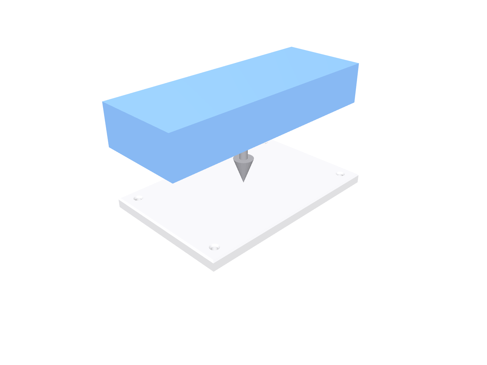
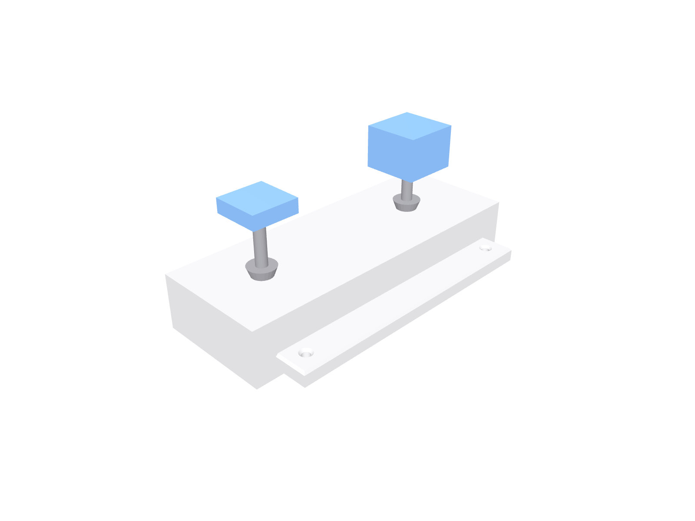

Build Test Min one step at a time, LEGO style. New parts in each
picture are shown in color; parts you already placed are ghosted grey.

## Step 1 — Mount the brain

Fasteners for this step:

- M2×6 self-tapping screw x2 — M2 x 6 mm pan head, self-tapping, for printed plastic

## Step 2 — Eyes and beeper

Press-fit both boards.

That's the hardware done. Next stop: [flash the firmware](./flash/).
