Build Rover one step at a time, LEGO style. New parts in each
picture are shown in color; parts you already placed are ghosted grey.

## Step 1 — Print check

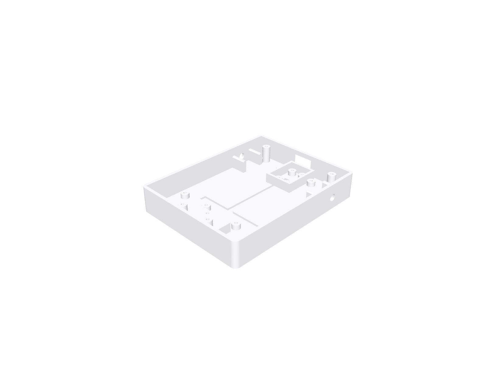

Confirm all printed parts against the print guide.

## Step 2 — Fit the left motor

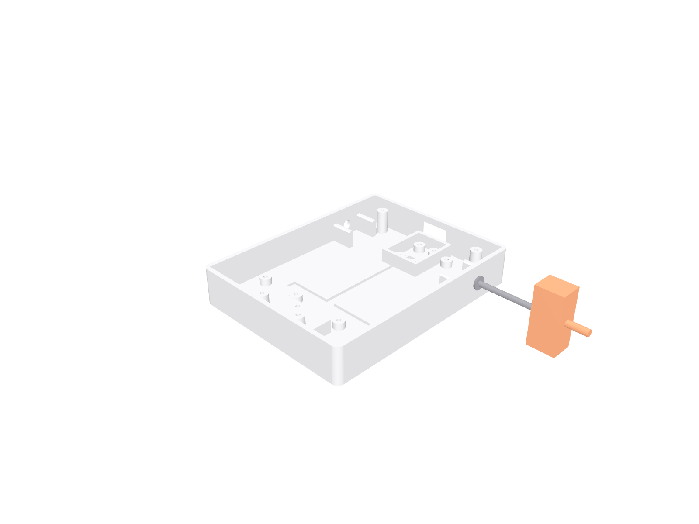

Wires face inward.

Fasteners for this step:

- M2×8 self-tapping screw x2 — M2 x 8 mm pan head, self-tapping, for printed plastic

## Step 3 — Fit the right motor

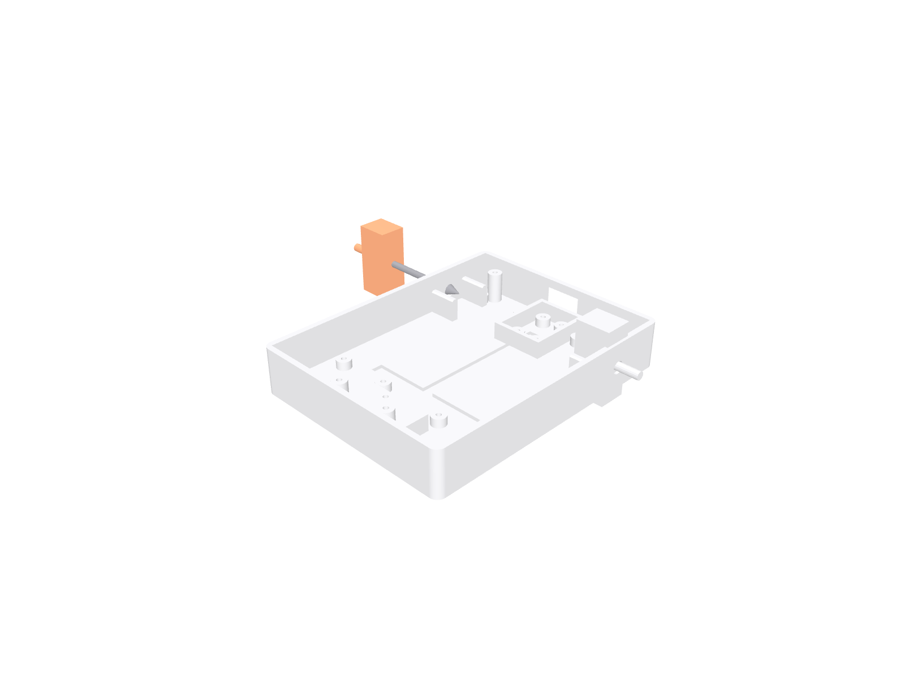

Mirror of step 2.

Fasteners for this step:

- M2×8 self-tapping screw x2 — M2 x 8 mm pan head, self-tapping, for printed plastic

## Step 4 — Caster ball

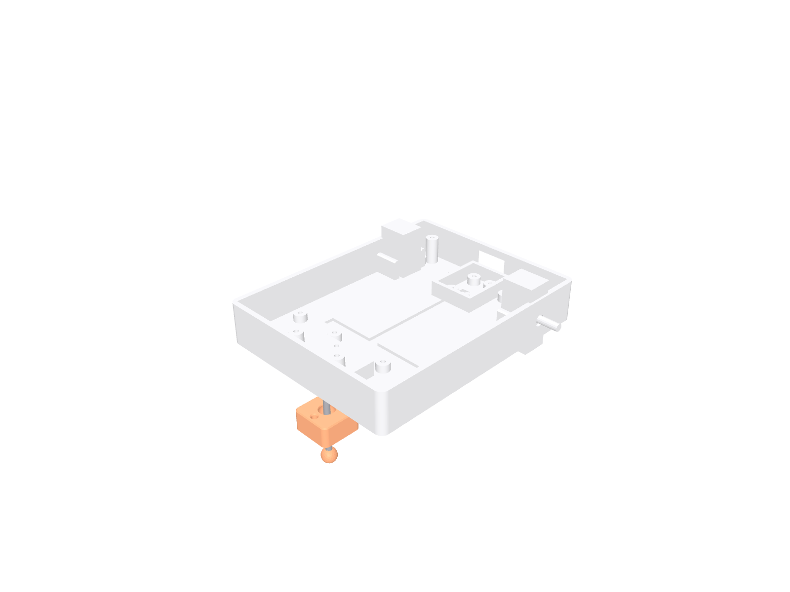

Fasteners for this step:

- M2×6 self-tapping screw x2 — M2 x 6 mm pan head, self-tapping, for printed plastic

## Step 5 — Motor driver

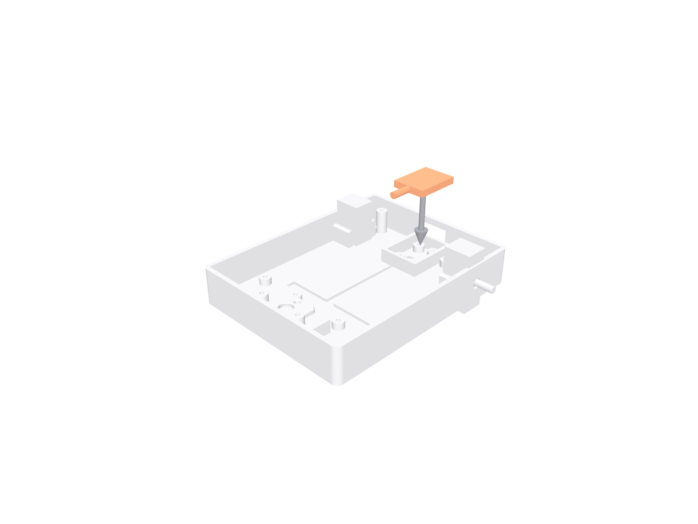

Fasteners for this step:

- M2×6 self-tapping screw x2 — M2 x 6 mm pan head, self-tapping, for printed plastic

## Step 6 — Power board + switch

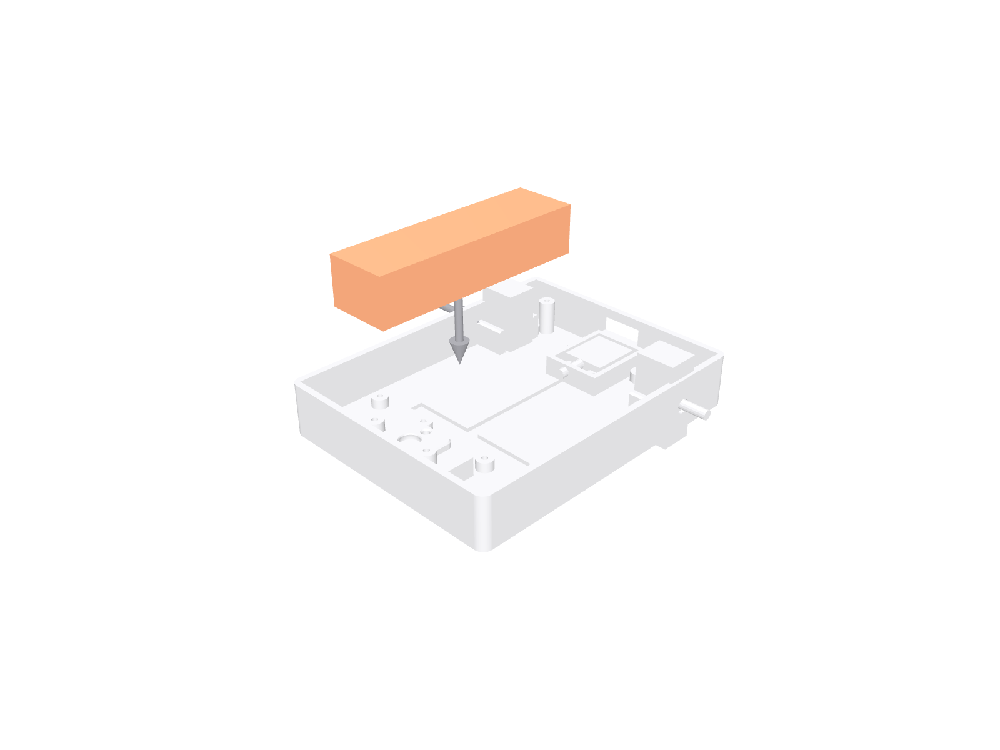

## Step 7 — The brain

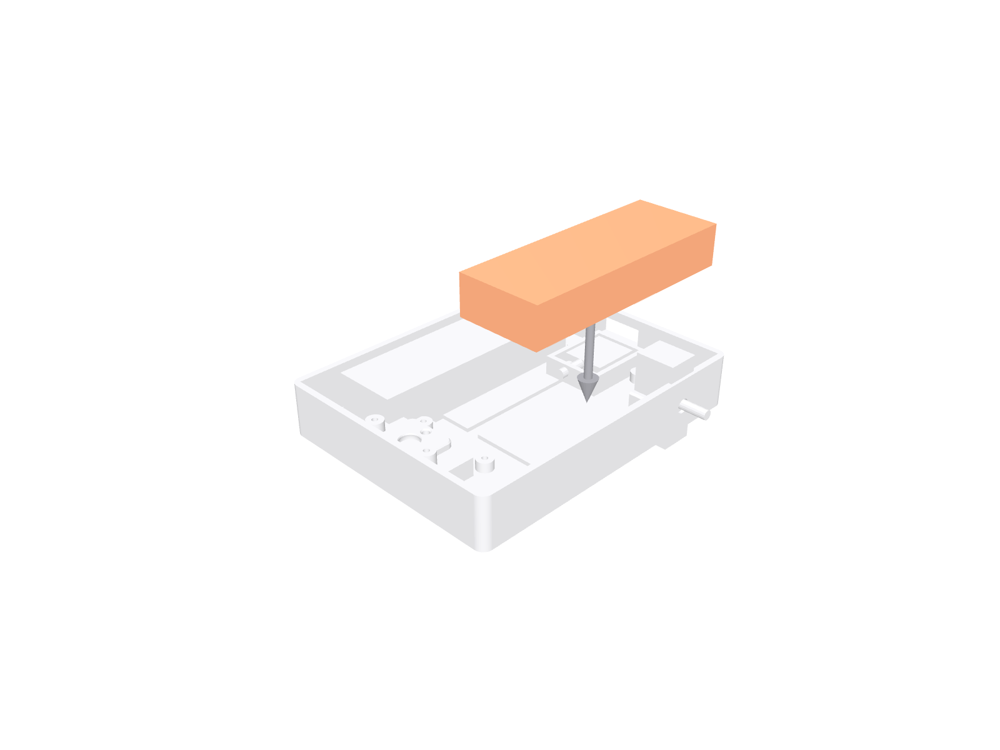

USB port faces the rear cutout.

## Step 8 — Wire it up

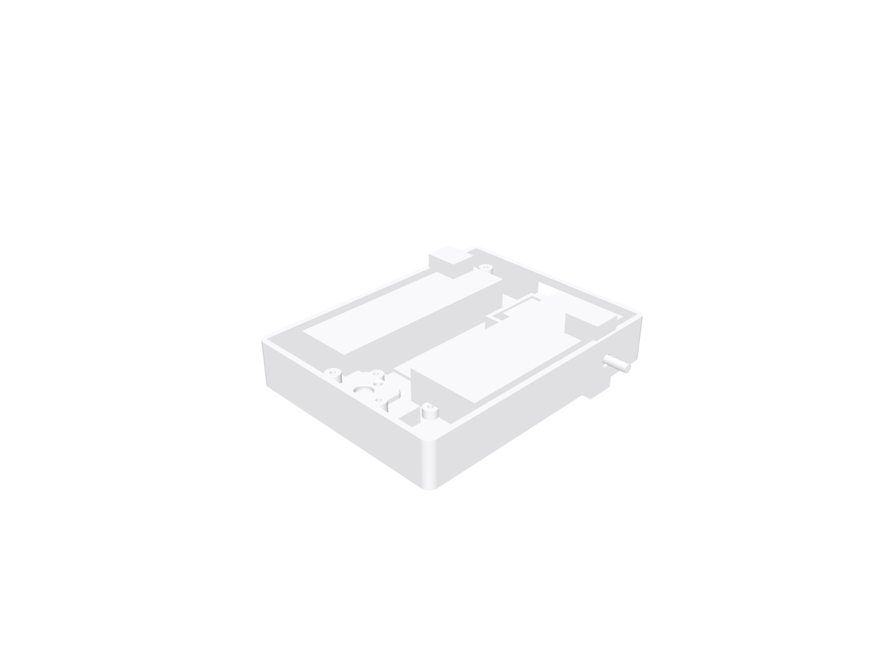

Follow the wiring diagram page — colors match.

## Step 9 — Sensors into the head

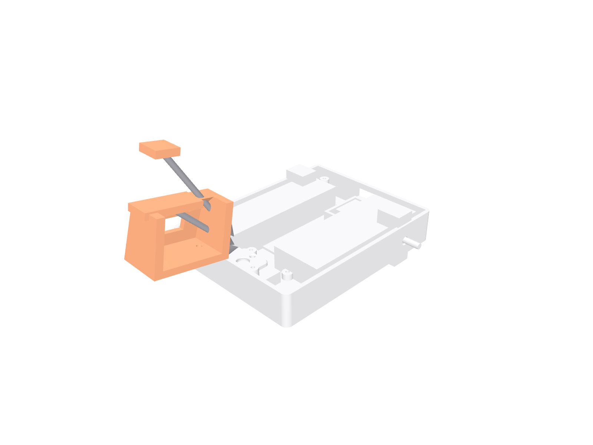

Press the distance sensor into the pocket behind the face (window at the front)

Fasteners for this step:

- M2×6 self-tapping screw x2 — M2 x 6 mm pan head, self-tapping, for printed plastic

## Step 10 — Line sensors + beeper

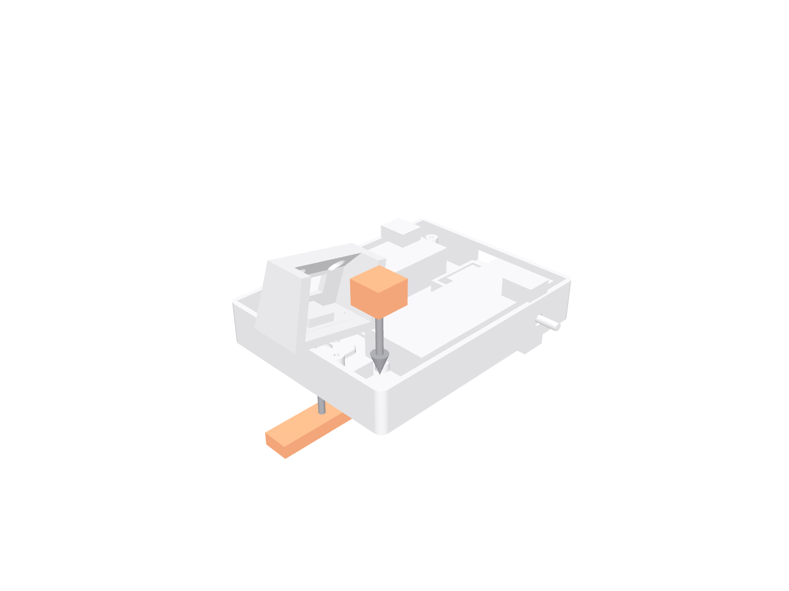

The line board clips under the front lip with its sensors facing the floor. The beeper drops into its pocket — a dab of glue or tape holds it if loose.

## Step 11 — Wheels + lid

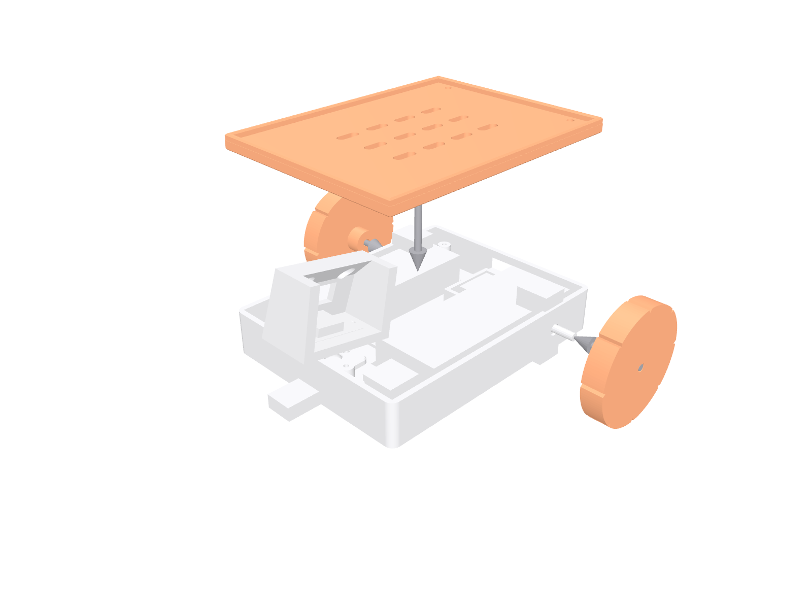

Push each wheel straight onto its motor's D-shaped shaft — a firm press

Fasteners for this step:

- M2×6 self-tapping screw x2 — M2 x 6 mm pan head, self-tapping, for printed plastic

That's the hardware done. Next stop: [flash the firmware](./flash/).
