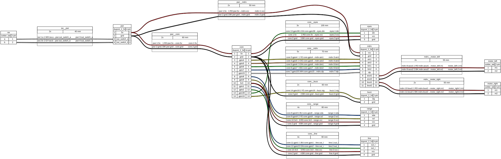

Every connection in Rover uses simple push-on jumper wires — no
soldering iron required. Wire colors in the diagram match the colors in the
wire list, so you can check your work at a glance.

## Wiring diagram

## Wire list

| From          | To                 | Color | Length (mm) |
| ------------- | ------------------ | ----- | ----------- |
| `pwr.5v`      | `core.5v`          | RD    | 60          |
| `pwr.gnd`     | `core.gnd`         | BK    | 60          |
| `pwr.5v`      | `mdrv.vcc`         | RD    | 50          |
| `pwr.gnd`     | `mdrv.gnd`         | BK    | 50          |
| `sw.a`        | `pwr.out_switch_a` | WH    | 40          |
| `sw.b`        | `pwr.out_switch_b` | GY    | 40          |
| `core.gpio4`  | `mdrv.ain1`        | YE    | 70          |
| `core.gpio5`  | `mdrv.ain2`        | OG    | 70          |
| `core.gpio6`  | `mdrv.bin1`        | GN    | 70          |
| `core.gpio7`  | `mdrv.bin2`        | BU    | 70          |
| `core.gpio15` | `mdrv.slp`         | WH    | 70          |
| `mdrv.aout1`  | `motor_left.m1`    | RD    | 55          |
| `mdrv.aout2`  | `motor_left.m2`    | BK    | 55          |
| `mdrv.bout1`  | `motor_right.m1`   | RD    | 55          |
| `mdrv.bout2`  | `motor_right.m2`   | BK    | 55          |
| `core.gpio8`  | `range.sda`        | BU    | 80          |
| `core.gpio9`  | `range.scl`        | YE    | 80          |
| `core.3v3`    | `range.vcc`        | RD    | 80          |
| `core.gnd`    | `range.gnd`        | BK    | 80          |
| `core.gpio1`  | `line.out_l`       | BU    | 90          |
| `core.gpio2`  | `line.out_r`       | GN    | 90          |
| `core.3v3`    | `line.vcc`         | RD    | 90          |
| `core.gnd`    | `line.gnd`         | BK    | 90          |
| `core.gpio38` | `eyes.din`         | GN    | 100         |
| `core.5v`     | `eyes.vcc`         | RD    | 100         |
| `core.gnd`    | `eyes.gnd`         | BK    | 100         |
| `core.gpio16` | `buzz.sig`         | YE    | 60          |
| `core.gnd`    | `buzz.gnd`         | BK    | 60          |

Cut or buy jumper wires a little longer than listed — slack is easier to tuck
away than a wire that is 5 mm too short. When everything matches the diagram,
continue to [assembly](./assemble/).
